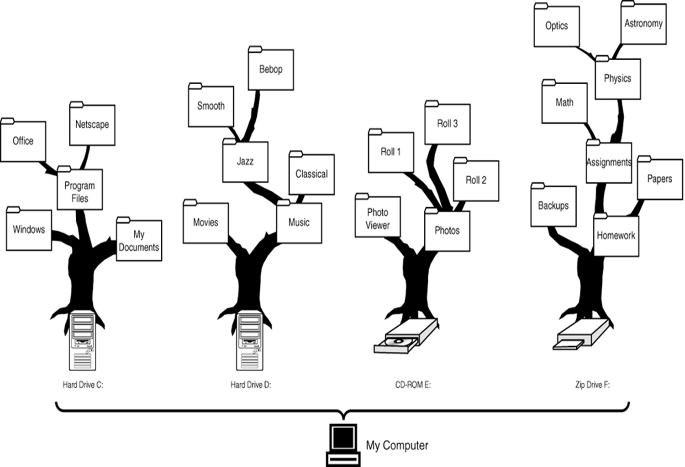
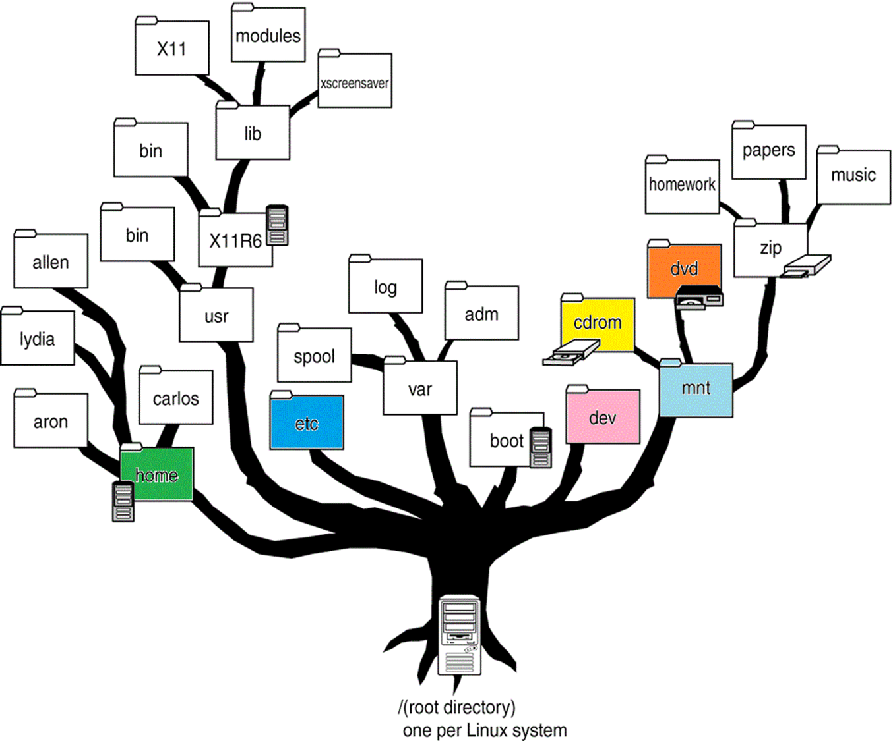
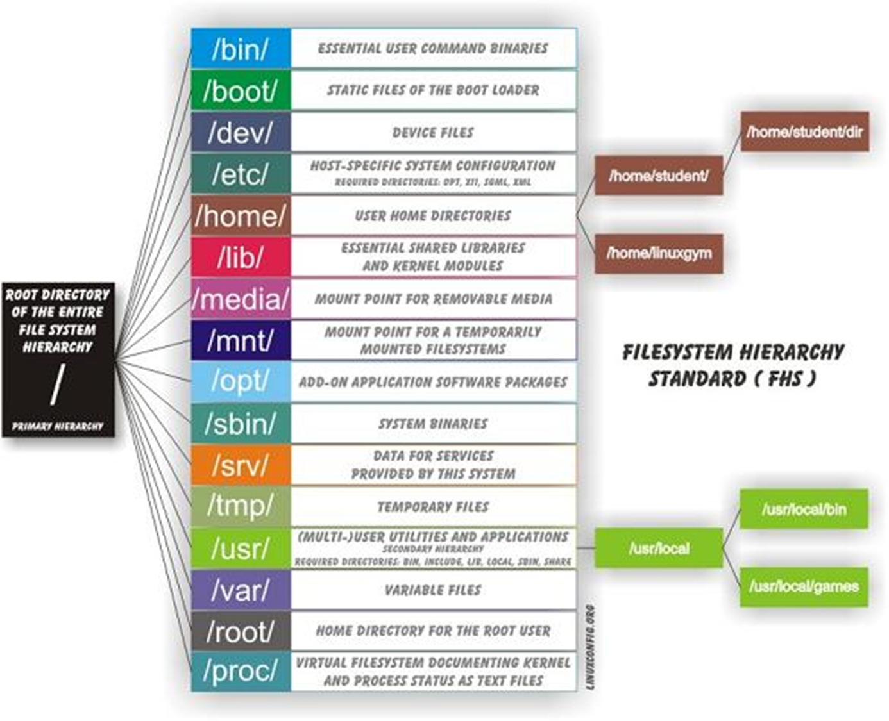
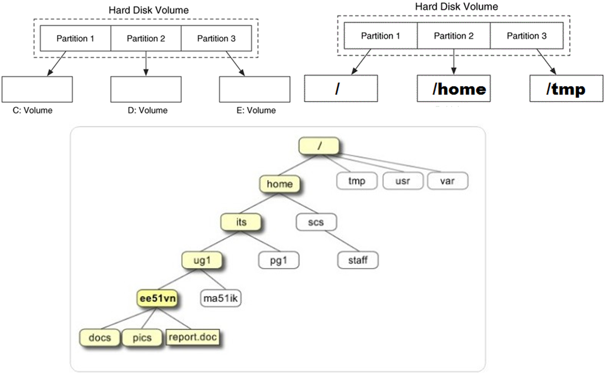
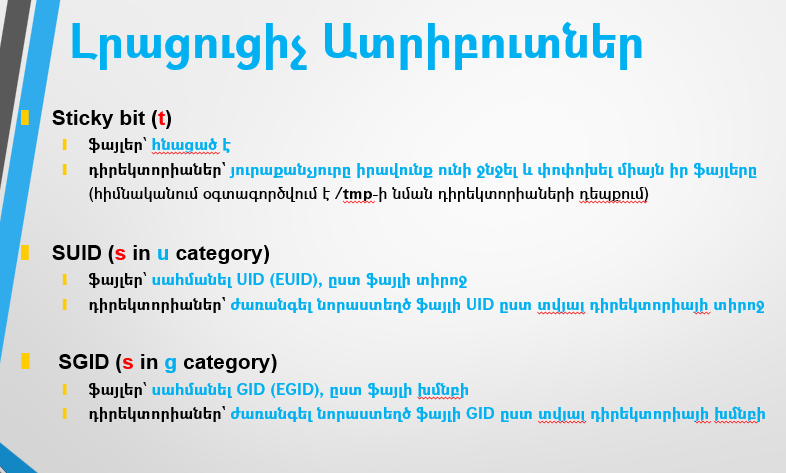
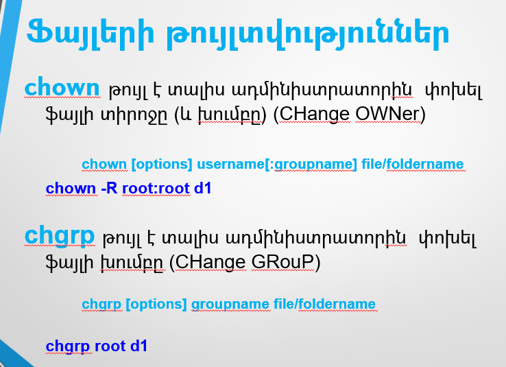
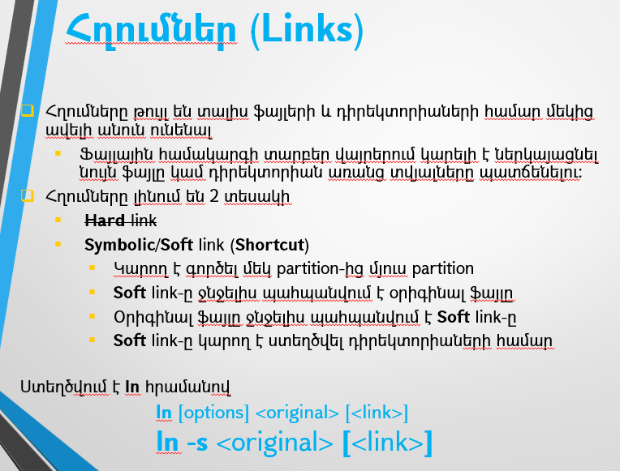
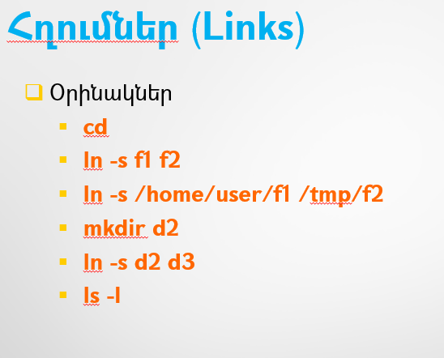

# Linux Essentials (level 1) Linux-ի Հիմունքներ (փուլ 1)

## Linux Terminal (Լինուքսի հրամանների տողը)


## Linux Terminal, CLI Basics

> Ինչ է Terminal-ը

Ծրագիր, որի ներսում գոծում է հրամանի տող (Command Line): 
Հնարավոր է դա լինի հեռակա միացումով (remote connection/access):
Այսինքն աշխատանքը իրականացվի ցանցով կապված մեկ այլ հեռակա համակարգի վրա:

> Ինչ է Command Line Interface/Interpreter (CLI) / Shell 

Ծրագիր, որը իրականացնում է հրամանի տողի աշխատանքը, 
վերլուծում է (interpret) տողը ու կատարում հրամանը կամ հայտնում սխալի մասին:

Հրամանները վերլուծվում են տող առ տող, այդ պատճառով ամեն մի հրամանը պետք է ավարտվի **[Enter]**-ով:
** [Enter]**-ից հետո հրամանը այլևս հնարավոր չէ փոխել:

> **#**  նշանը և դրանից հետո ամեն ինչը համարվում է comment և չի վերլուծվում:  

CLI այլ կերպ նաև անվանվում է Shell: Լինում են տարբեր տեսակներ, ամենատարածվածը` **Bash**

CLI / Shell / Bash աշխատում է ինտերակտիվ եղանակով, որը նաև անվանում են REPL 


**Read** -> **Evaluate** -> **Print** -> **Loop**  


> Լինուքսի յուրահատկությունը

Մեծատառի/փոքրատառի տարբերություն (LiNuX iS CaSe SeNsItIvE)

  * Հրամանների և ծրագրերի անվանման մեջ 
    * `command`
    * `Command` 
    * `COMMAND` 
    
  * Ֆայլերի և դիրեկտորիաների/ֆոլդերների անվանման մեջ
    * `file`
    * `File`
    * `FILE`
    
  * Օգտագործողների և խմբերի անվանման մեջ
    * `user`
    * `User`
    * `USER`


> Command Prompt

Տողային հարաման մուտքագրելու հրավեր:

Օրինակներ.

**$** - User Prompt

**#** - ROOT Prompt

Այս հրավերի տեսքը հնարավոր է փոխել, 
սակայն հաճախ նշված նշանները պահպանվում են 
և ավելանում է լրացուցիչ տեղեկություն, 
օրինակ՝ սերվերի, օգտագործողի, տվյալ դիրեկտորիայի անունները:

`student@server:/usr/bin$`

<br><br>

> Movement in command line

Աջ/ձախ սլաքներից բացի հրամանային տողում տեղաշարժ

* `Ctrl-A` – տեղափոխել տողի սկիզբ
* `Ctrl-E` – տեղափոխել տողի վերջ


> Command structure

Հրամանների կառուցվածք


> Հրամանների օրինակներ


* echo - display a line of text 
```bash
echo We learn Linux # this is a comment 
```
```bash
# echo We learn Linux # this is a comment
```

```bash
echo "$USER" learns Linux OS
```
```bash
echo My Shell is: "$SHELL"
```

* sleep - delay for a specified time 

```bash
echo ; echo -n "Be patient " ; sleep 2 ; echo -n "to learn " ; sleep 2 ; echo "LINUX Operating System" ; sleep 2 ; echo 

```

* id - display user information

```bash
id
```
```bash
id --help
```
```bash
id -n -u
```

* date - display date

```bash
date
```
```bash
date --help
```
```bash
date +"%d-%m-%Y"
```

> Command History 

Նախորդ հրամանները հիշվում են, որ նորից նույնը չհավաքենք:

* Վերևի սլաքը (Up Arrow) նախորդ հրամանները
* Որոնում նախորդ հրամաններում `Ctrl-R`
  * մուտքագրեք հրամանի սկիզբը
  * Կրկնելով `Ctrl-R` հնարավոր է փնտրել նախորդ տարբերակները
    * Օրինակ՝ սեղմեք `Ctrl-R` և հավաքեք ՝da`
    * Կրկնեք `Ctrl-R`
  

> Filename/Command completion 	

Հնարավոր է ամբողջությամբ չլրացնել հրամանի/ֆայլի անունը՝ համակարգը կարող է ամբողջացնել անունը

* `[Tab]`	հրամանի/ֆայլի լրացում, եթե դա միակ տարբերակն է
  * Օրինակ՝ հավաքեք ՝sle` և `[Tab]`

<br><br>
* `[Tab] [Tab]` եթե մեկից ավել տարբերակ կա, ապա ցուցադրվում են բոլոր տարբերակները
  * Օրինակ՝ հավաքեք ՝sl` և `[Tab] [Tab]`

<br><br>

## File Management

> Ֆայլերի անվանումը
* Windows
  * `C:\Program Files\Oracle\VirtualBox\VirtualBox.exe`

* Linux/UNIX

  * `/home/user1/docs/letter.txt`
  * `/bin/ls`


### Ծանոթացում Լինուքսի ֆայլային համակարգի կառուցվածքին


* Տվյալները Լինուքսում պահպանվում են`
  * կոշտ սկավառակի կամ այլ կրիչների վրա 
  * Ֆայլերի տեսքով, որոնք ներկայացվում են օգտագործողին ծառաձև դիրեկտորիաների կառուցվածքով 

* **Filesystem**/**Ֆայլային համակարգ**՝ որոշակի ստանդարտին համապատասխանող տվյալները սկավառակի/կրիչի վրա պահպանելու կառուցվածք
  * Նպատակն է հեշտ հասանելի դարձնել տվյալները

* Լինուքսը "հասկանում" է ֆայլային համակարգերի բազմաթիվ ստանդարտներ, օրինակ.
    * ext2, ext3, ext4, xfs, zfs, jfs, btrfs
    * FAT16, FAT32, NTFS, ISO9660, UDF


* Դիրեկտորիաների կառուցվածքը 
  * կազմում է հիերարխիկ ֆայլային համակարգ 
  * Լինուքսի յուրահատկությունը՝ 
    * Միասնական ծառ, ոչ թե  **C:**  **D:**  **E:** դիսկեր 







### Linux Partition Mounting (հատվածնեչի կցում)

* Partition հատվածները որպես առանձնացված տառերով դիսկեր ներկայացնելու փոխարեն, Լինուքսում կա 
  * գլխավոր հատված՝ **root partition**
  * մյուս հատվածները կցվում են (mount) գլխավորի որևէ կետին` դիրեկտորիային
* Յուրաքանչյուր Partition հատվածը ունի որոշակի ստանդարտի առանձին ֆայլային համակարգ




ճանապարհը դեպի ՝report.doc՝ ֆայլը նշելու տաբերակներ.
* Ցանկացած տեղից
  * /home/its/ug1/ee51vn/report.doc
* Եթե գտնվում ենք ՝ee51vn՝-ում
  * ee51vn/report.doc
  * ./ee51vn/report.doc
  * ../ug1/ee51vn/report.doc

* Եթե գտնվում ենք ՝scs/staff՝-ում
  * ../../its/ug1/ee51vn/report.doc


```bash 
ls /
```

```bash
man file-hierarchy
```

### PRACTICE

Տեղադրեք `tree` ծրագիրը

```bash
sudo yum -y install tree

```

Ցուցադրեք "**/**"-ի մեջ առկա գլխավոր դիրեկտորիաները `tree` հրամանի միջոցով

Գտեք անհրաժեշտ պարամետրերը `man tree`-ի օգնությամբ


> Ավելին իմանալու համար. https://en.wikipedia.org/wiki/Filesystem_Hierarchy_Standard 


Երբ մուտքագրվում եք  (բացվում է Terminal-ը), հայտնվում եք ֆայլային համակարգի ընթացիկ դիրեկտորիայում:

> Հիմնական հրամաններ
* `pwd` - ընթացիկ դիրեկտորիան
* `cd` - փոխել ընթացիկ դիրեկտորիան
  * Օրինակ՝ հավաքեք ՝cd /h` և `[Tab]` հետո ևս մեկ `[Tab]`
  * Օրինակ՝ հավաքեք ՝cd /u` և `[Tab]` հետո `lo` և `[Tab]` հետո `b` և `[Tab]`


* `ls` - ֆայլերի ցուցակ
<hr>

`ls [options] <directory/file>`

* `-l`     ընլայնված ցուցակ
* `-a`  ցույց տալ բոլոր ֆալերը  (նեռարյալ .-ով սկսվող ֆալերը )
* `-S`   դասավորել ֆայլերը ըստ չափի (–lS)
* `-r`  Հակադարձ դասավորման կարգով (–lSr)
* `-h`    Մարդու համար ավելի ընթեռնելի (ֆայլերի չափը k, M, G-ով)


<hr> 

> ՕԳՏԱԿԱՐ ԿԱՅՔ՝ 
> https://explainshell.com/
> հրամանների մանրամասն բացատրություն: 
> Բացեք կայքը և մուտքագրեք հրաման, օրինակ

```bash
id -n -u
```

կամ

```bash
echo -n "Be patient " ; sleep 2 ; echo -n "to learn LINUX" ; sleep 2
```
<hr> 

> Հատուկ անվանումներ
* `/`   Գլխավոր դիրեկտորիան
* `.`    Տվյալ դիրեկտորիան
* `..`   Նախորդ (վերևի) դիրեկտորիան
* `~`    Օգտագործողի անձնական դիրեկտորիան
* `.`-ով սկսվող ֆայլերը սովորաբար օգտագործվում են անհատական կարգավորումները պահելու համար:
  (կետը տվյալ դեպքում ֆայլի անվանման մասն է)


Օրինակներ՝

`./a`        նույնն է ինչ   `a`

`../home/student`  մեկ մակարդակ վերև և home/student

```bash
ls -la ~/.bash*
```


<hr>

> Հիմնական հրամաններ
* `touch`                    Ստեղծել դատարկ ֆայլ
* `cp <fromfile> <tofile>`   	Պատճենել ֆայլը
* `mv <fromfile> <tofile>`	Տեղափոխել / վերանվանել ֆայլը
* `rm <file>`  			Հեռացնել ֆայլ/դիրեկտորիա
* `mkdir <newdir>`		 Ստեղծել դիրեկտորիա 
* `alias <alias> <command>` Ստեղծել հրամանի կրճատում 


> Հրամանների օրինակներ

```bash 
cd /home ; pwd ; ls -la
```

```bash 
cd ; ls -la /home
```

```bash 
mkdir d1 ; cd d1 ; pwd ; touch f1 ; ls f*
```

```bash 
cp f1 f2 ; ls f*
```

```bash 
mv f2 f3 ; ls f*
```

```bash 
alias del="rm -i" ;\
alias

```

```bash
echo 'alias del="rm -i"' >> ~/.bash_aliases

```


```bash 
del f*
```

```bash 
cd ~ ; rm -r d1
```


<hr>

```bash 
cp -r /etc ~
```

```bash 
mkdir ~/TEST
```

```bash 
mv  ~/etc  ~/TEST
```

```bash 
rm -r ~/TEST
```


### PRACTICE

* `clear` հրամանը մաքրում է էկրանը
  * ստեղծել `c` անունով `alias`, որ մաքրում է էկրանը
  * պահպանել այն, որ գործի մյուս մուտքագրվելիս նույնպես

* ստեղծել երկու հրամանից բաղկացած `alias`, որը
  * կտեղափոխի վերեվի դիրեկտորիա 
  * և պտպի ներկայիս գտնվելու վայրը 
  * պահպանել այն, որ գործի մյուս մուտքագրվելիս նույնպես


### Փոփոխականներ
Shell/Bash variables - temporary storage for information
Bash does not care about the type of variables. 
Variables could store strings, characters or integers. 

Variable names are uppercase by convention, but lowercase and other symbols can be used as well.

Syntax: **VARNAME=VALUE**

> Note: There should be no space around `=` sign 

The example assigns the value `/usr/bin` to the variable called `LIST`
Prefix the variable name with `$`, which will give the value stored in that variable.

#### PRACTICE

```bash
LIST="/usr/bin/" ; ls -l $LIST
```


<br><br>

## File Permissions


<br><br>

<br><br>

<br><br>

<br><br>

<br><br>

<br><br>

<br><br>









## Access files

There are several tool to view text files contents.

> **less** - view/browse text file page-by-page

* **Enter/DOWNARROW**	– մեկ տող ներքև
* **SPACE/PgDn**		– մեկ էկրան ներքև
* **PgUp/b**			– մեկ էկրան վերև
* **UPARROW**			– մեկ տող վերև
* **/**					– որոնում
* **Home**				– անցնել տեքստի սկիզբը
* **End**				– անցնել տեքստի վերջը
* **q**					– ելք

> Օրինակներ
 
`less /etc/services`
`ls /usr/bin | sort -r | less`

<br><br>

> **cat** - output whole file to STDOUT (default - terminal)

> Օրինակներ
 
`cat /etc/services`

`cat /etc/services | sort -r `

`cat /etc/services | sort -r | less`

<br><br>

> **head** - output some first lines (default 10) of file STDOUT (default - terminal)

> Օրինակներ
 
`head /etc/services`

`head -1 /etc/services`

`head -1 /etc/services > /tmp/h1`

`head -1 /etc/services >> /tmp/h1`
 
<br><br>

> **tail** - output some last lines (default 10) of file STDOUT (default - terminal)

> Օրինակներ
 
`tail /etc/services`

`tail -1 /etc/services`

`tail -1 /etc/services > /tmp/s1`

`tail -1 /etc/services >> /tmp/s1`

<br><br>

> **grep** - filter lines based on pattern

> Օրինակներ
 
`cat /etc/services | grep http `

`ls /usr/bin | grep log`

`ls /usr/bin | grep ^log`

`ls /usr/bin | grep log$`

> **wc** - count number of **lines**, words, characters 

> Օրինակներ
 
`wc -l /etc/passwd`

`wc  -l < /etc/group`


#### Advanced Text Processing - AWK 

> **AWK**  - extract sections/fields from each line of files


Examples

```bash
awk -F":" '{print $1}' /etc/passwd | grep ^s
```

```bash
tail -10 /etc/passwd | awk -F":" '{print $3"--"$1}' | sort -n
```

```bash
cat /etc/passwd | grep -E ^'(b|sy)' | awk -F":" '{print "User: "$3"  "$1}'
```

```bash
cat /etc/passwd | awk -F":" '/nologin$/ {print $1"-"$5}'
```

##### Task:
Modify the above command, to narrow selection by only lines starting with s  


<br><br>

#### Advanced Text Processing – SED 

Sed is a very useful **S**tream **ED**itor.  
It's ideal for batch-editing files or for creating shell scripts to modify existing files in powerful ways. 
It's rather complex for quick full understanding, so below are only few use cases.

One of sed's most useful commands is the _**substitution**_ command. 

Following command takes a stream from pipe and replaces first occurrence of `:` on each line to `<*>`: 

```bash
cat /etc/passwd | sed -e 's/:/<*>/'
```

To replace all occurrences we should add `g` to make replacement global: 

```bash
cat /etc/passwd | sed -e 's/:/<*>/g' 
```

Another useful examples with SED: 

Output lines `5-7` 

```bash
sed -n '5,7p' /etc/group
```

**-n** causes not to output each processed lines<br>
**p** command specifies print (output) specified line range: 5-7 


Output all lines except `1-20` 

```bash
sed '1,20d' /etc/group
```

**d** command causes specified line range: 
`1-20` to be deleted/removed from output, 
other lines will be present in output 

Remove comments (lines starting with '#' - `^#`) and empty lines `^$` from output:  

```bash
sed '/^#\|^$/d' /etc/rsyslog.conf
```

**d** command causes specified lines: <br>
**^#** - starting with **#** <br>
or **\\|** <br>
**^$** - empty line (**^**- line start, **$** - line end) 
to be deleted/removed from output, 
other lines will be present in output. 


<br><br>

## I/O Redirection


<br><br>

<br><br>


> STDOUT - Standard output  		>     >> 
 
* `ls /etc > ~/stdout`
* `ls /etc >> ~/stdout`

> STDERR - Standard error output		2>   2>> 
* `ls /e > ~/stdout`
* `ls /e > ~/stdout 2> ~/stderr`
* `ls /e > ~/stdout 2> /dev/null`

<br><br>

## Pipes

Pipeline - Մեկ հրամանի STDOUT-ը ուղարկել այլ հրամանի STDIN-ին

<br><br>

> Օրինակ

`ls /usr/bin | sort -r`

Նույնը չէ, ինչ հաջորդաբար կատարումը `;`-ով

`ls /usr/bin ; sort -r`

> Հրամանների համակցում

Հրամանները կարելի է համակցել հետևյալ կերպ՝

* **;**	Պարզապես կատարել հրամանները՝ մեկը մյուսի հետևից

* **|**	Փոխանցել առաջին հրամանի ելքի տվյալները (stdout) 
    երկրորդ հրամանի մուտքին (stdin)

* **&&**	Logical AND 
    եթե առաջին հրամանի ելքի կոդը (exit code) 0 է, կատարել երկրորդը

* **||**	Logical OR
    եթե առաջին հրամանի ելքի կոդը (exit code) 0 չէ, կատարել երկրորդը

_( **echo $?**  - ցույց է տալիս վերջին հրամանի ելքի կոդը (exit code) 0=OK)_


> Օրինակներ

* `cd /home && pwd`
* `cd /hh && pwd`
  * QUESTION: how to get rid of `cd: /hh: No such file or directory`
* `cd /home || echo "Wrong directory"`
  * change `/home` to `/hh` and run again
* ```bash
  DD=/bin ; [ -d $DD ] ; echo "Exit code is: $?"
  ```
* ```bash
  DD=/bn ; [ -d $DD ] ; echo "Exit code is: $?"
  ```
  


<br><br>
## Text Editors (Խմբագիրներ)

* **nano**		Standard Linux editor - for newcomers - present in most LINUX versions
* **vi /vim**	Standard UNIX editor - for experienced users - present in most UNIX/Linux versions

There are more editors, like **mcedit** or **joe**, which are mostly not installed by default.


### Nano editor basics

`nano` is an easy to use text editor for UNIX/Linux operating systems. 
It includes all the basic functionality of text editor.
When you run `nano` main commands are displayed at the bottom. 

Most commands are prefixed with `^`, which means `Ctrl` key<br> 
*  `^G` means press `Ctrl`+`g`  (NOT `G`)


### Vim/Vi basics

`vim`/`vi` is a very powerful editor UNIX/Linux text editor. 
The reason to know it's basics is that it is initially available almost on any UNIX/Linux system.
Even if any other editor will not be present or available to install Vi/Vim will be there to enable you editing text files.
(one way to learn `vi` basics is to type `vimtutor` and follow instructions).

> Vim Modes
* **Command**	- Single keystroke mostly to switch mode ( "**i**" ) or do other actions
* **Insert/Input**	- Main mode to modify text by typing
* **Execute**	- Execute commands within the editor

There is also much rarely used **Visual** mode for highlight or select text for copying, deleting, etc 


> REMEMBER ! 
> If you get confused in which mode you are in just **press the `ESC` key a couple of times and start over** with what you were doing.

<br><br>

> Execute Mode Commands

* **ZZ**    - Quit saving changes if any 

other variants:
* **:q**	- Quit when no changes have been made after last save
* **:q!**	- Quit ignoring changes made
* **:wq**	- Save current file and quit
* **:w {file name}** - Save file with specified name

<br><br>


### PRACTICE

Create new file in `vi` editor

* Type 
```bash
vi testfile1
``` 
to open `vi` with new file `testfile1`
* Press the `i` key to switch to **Insert/Input** mode.
* Type something like: <br><br> 
`We are interested `<br>
`to learnLinux`
<br><br>
* Press the `ESC` key for command mode
* Type `ZZ` to save and quit the file


## su, sudo


<br><br>

<br><br>