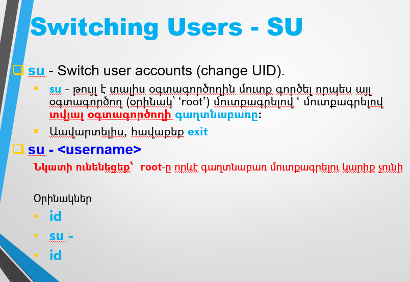
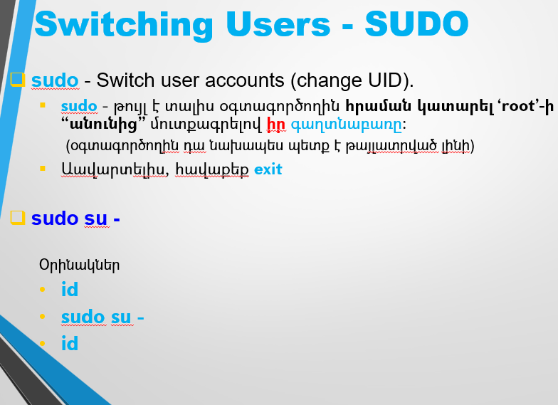

# Linux Essentials (level 1) Linux-ի Հիմունքներ (փուլ 1)

## Linux Terminal (Լինուքսի հրամանների տողը)

> Ներածական հարցեր թեմայի վերաբերյալ 
* Ծանո՞թ եք տերմինալի միջոցով Linux-ում աշխատելուն
* Եթե այո ի՞նչ ծրագրի միջոցով
* Ծանո՞թ եք SSH-ով միանալուն
  * ssh (Windows-ի հրամանային միջավայրում)
  * Putty
  * Xshell
  * MobaXterm
* Ծանո՞թ եք Windows Subsystem for Linux (WSL) in Windows 10/11
  

Լինուքս համակարգ մուտքագրվելու հիմնական ձևն է՝
անուն (username) և գաղտնաբառ (password) մուտքագրելը

SSH-ով միանալու պարագայում գաղտնաբառի փոխարեն հնարավոր է մուտքը զույգ-բանալիներով (Public/Private Keys)

<br><br>

## Linux VM remote access

* **Oracle VM VirtualBox** միջավայրում միացրեք վիրտուալ մեքենան

### Local login
* մուտք գործեք
  * **student** անունով
  * **123456** գաղտնաբառով

### Remote login
* Նկատեք ՝IP address`-ը:
* Windows-ում բացեք հրամանների միջավայրը (`cmd`)
* միացեք SSH-ով ՝student՝ անունով ու IP-հասցեյով (password - `123456`)

`ssh student@<ip-address>`


## CLI vs GUI

Լինուքս համակարգում հնարավոր է աշխատել հետևյալ տարբերակներից մեկով. 
* Graphical User Interface (**GUI**)
* Command Line Interface (**CLI**) / Terminal

Այս դասընթացի ընթացքում մենք հիմնականում կաշխատենք երկրորդ (**CLI / Terminal**) տարբերակով, քանի որ դա Լինուքս համակարգի սերվերային տարբերակի 
հիմնական տարբերակն է: 
Լինուքսի համար կան նաև շատ գրաֆիկական միջավայրեր (**GUI**), բայց սերվերային տարբերակներում դրանք սովորաբար նույնիսկ չեն տեղադրվում 
և դրանց իմաստն էլ չկա, քանի որ նման համակարգերում չկան նույնիսկ մոնիտորներ:
Գրաֆիկական միջավայրերը ավելի շատ օգտագործվում են Linux-ի Desktop տարբերակներում:

Ինչպես ասացինք, գրաֆիկական միջավայրը լրացուցիչ է և տեքստայինից դրան անցում կարելի է անել, 
միայն եթե տեղադրվածեն համապատասխան փաթեթներ։

Ընթացիկ ռեժիմը կարող ենք իմանալ հետևյալ հրամանով.
```bash
systemctl get-default
```
* **graphical.target** → գրաֆիկական միջավայր (**GUI**)
* **multi-user.target** → տեքստայինից միջավայր (**CLI / Terminal**)


Միացնել գրաֆիկական միջավայրը կարելի է հետևյալ հրամանով.
```bash
systemctl isolate graphical.target
```
Սակայն դա չի պահպանվի համակարգը համակարգը անջատել-միացնելուց հետո

> ✅ ԿԱՐԵՎԵՐ Է <br>
> Գրաֆիկական միջավայրը աշխատում է տեքստայինի «վրայից» (**GUI** on top of **CLI**) <br>
> Կարելի է միշտ անցում կատարել դեպի «տակի» տեքստային տերմինալներ, որոնք սովորաբար մի քանիսն են <br>
> Անցում դեպի տեքստային տերմինալ՝  **Ctrl + Alt + (F1 – F12)** <br>
> Վերադարձ/տեղափոխում տերմինալների միջև՝  **Alt + (F1 – F12)** <br>


Միացնել տեքստային միջավայրը կարելի է հետևյալ հրամանով.
```bash
systemctl isolate multi-user.target
```

Հատուկ այս դասի համար ունենք կարճ այլընտրանքային հրամաններ 

```bash
turn-gui
```

```bash
turn-txt
```


## Linux Terminal, CLI Basics

> Ինչ է Terminal-ը

Ծրագիր, որի ներսում գոծում է հրամանի տող (Command Line): 
Հնարավոր է դա լինի հեռակա միացումով (remote connection/access):
Այսինքն աշխատանքը իրականացվի ցանցով կապված մեկ այլ հեռակա համակարգի վրա:

> Ինչ է Command Line Interface/Interpreter (CLI) / Shell 

Ծրագիր, որը իրականացնում է հրամանի տողի աշխատանքը, 
վերլուծում է (interpret) տողը ու կատարում հրամանը կամ հայտնում սխալի մասին:

Հրամանները վերլուծվում են տող առ տող, այդ պատճառով ամեն մի հրամանը պետք է ավարտվի **[Enter]**-ով:
** [Enter]**-ից հետո հրամանը այլևս հնարավոր չէ փոխել:

> **#**  նշանը և դրանից հետո ամեն ինչը համարվում է comment և չի վերլուծվում:  

CLI այլ կերպ նաև անվանվում է Shell: Լինում են տարբեր տեսակներ, ամենատարածվածը` **Bash**

CLI / Shell / Bash աշխատում է ինտերակտիվ եղանակով, որը նաև անվանում են REPL 

**Read** -> **Evaluate** -> **Print** -> **Loop**  

## LiNuX iS CaSe SeNsItIvE

Լինուքսի առանձնահատկություններից մեկը այն է, որ այս համակարգում տարբերություն կա **մեծատառերի** և **փոքրատառերի** միջև։

  * Հրամանների և ծրագրերի անվանման մեջ 
    * `command`
    * `Command` 
    * `COMMAND` 
    
  * Ֆայլերի և դիրեկտորիաների/ֆոլդերների անվանման մեջ
    * `file`
    * `File`
    * `FILE`
    
  * Օգտագործողների և խմբերի անվանման մեջ
    * `user`
    * `User`
    * `USER`


### Command Prompt

Հարաման մուտքագրելու հրավեր:

Օրինակներ.

**$** - User Prompt

**#** - ROOT Prompt

Այս հրավերի տեսքը հնարավոր է փոխել, սակայն հաճախ նշված նշանները պահպանվում են և ավելանում է լրացուցիչ տեղեկություն, 
օրինակ՝ սերվերի, օգտագործողի, տվյալ դիրեկտորիայի անունները:

`student@server:/usr/bin$`

<br><br>

#### Movement in command line

Աջ/ձախ սլաքներից բացի հրամանային տողում տեղաշարժ

* `Ctrl-A` – տեղափոխել տողի սկիզբ
* `Ctrl-E` – տեղափոխել տողի վերջ


#### Command structure

Հրամանների կառուցվածք

<pre>
┌──────────────┬────────────┬─────────────┐
│    Command   │   Option   │   Argument  │
├──────────────┼────────────┼─────────────┤
│    հրաման    │ ընտրանքներ │ արգումենտներ│
├──────────────┼────────────┼─────────────┤
│              │            │             │
│      cal     │     -m     │     2025    │
│              │            │             │
└──────────────┴────────────┴─────────────┘

💡 Հիմնական կանոններ.
1. Յուրաքանչյուր հատված բաժանվում է միմյանցից բացատներով /SPACE/
Դա շատ կարևոր է, քանի որ համակարգը մարդ չէ և չի կարող հասկանալ միասին գրվածը 
`cal-m2025`
`cal -m2025`
`cal-m 2025`

2. հաջորդականությունը կարևոր է. 
    «հրաման [ընտրանքներ] [արգումենտներ]»

3. Ընտրանքները փոխում են աշխատաձևը (-m = սկսել երկուշաբթիից)
3.1 Ընտրանքները լինում են.
        - կարճ : `-a` (մեկ գծիկ, մեկ տառ)
        - երկար: `--all` (երկու գծիկ, բազմատառ)
3.2 կարճ ընտրանքները կարելի է միավորել
         ՝ls -l -a -h /home/student՝  =  ՝ls -lah /home/student՝

4. Արգումենտներ տվյալներ են տրամադրում (2025 = տարի, /home/student = դիրեկտորիա)

</pre>


<pre>
[հրաման] [աշխատաձև] [մուտքի տվյալներ]
   cal      -m          2025
</pre>


### Command examples

Հրամանների օրինակներ

* echo - display a line of text 
```bash
echo We learn Linux # this is a comment 
```
```bash
# echo We learn Linux # this is a comment
```

```bash
echo "$USER" learns Linux OS
```
```bash
echo My Shell is: "$SHELL"
```

* sleep - delay for a specified time 

```bash
echo ; echo -n "Be patient " ; sleep 2 ; echo -n "to learn " ; sleep 2 ; echo "LINUX Operating System" ; sleep 2 ; echo 

```

* id - display user information

```bash
id
```
```bash
id --help
```
```bash
id -n -u
```

* date - display date

```bash
date
```
```bash
date --help
```
```bash
date +"%d-%m-%Y"
```

### Command Manuals (man)

Գրեթե յուրաքանչյուր հրամանի վերաբերյալ հնարավոր է ստանալ բացատրող տեղեկատվություն այդ հրամանի դեմը գրելով `man`:
<br> <br>
Ելքը - ՝q՝ 

```bash
man cal
```

```bash
man echo
```

```bash
man sleep
```

```bash
man id
```

```bash
man date
```

Հրամանի `--help` կամ `-h` ընտրանքները (options) նույնպես տեղեկատվություն են տրամադրում, բայց այն հակիրճ է:


### Command History 

Նախորդ հրամանները հիշվում են, որ նորից նույնը չհավաքենք:

* Վերևի սլաքը (Up Arrow) նախորդ հրամանները
* `history` հրամանը ցույց է տալիս բոլոր նախորդ հրամանները (հիմնականում պահվում են վերջին 500, 1000 կամ 2000 հրամանները)
* Որոնում նախորդ հրամաններում `Ctrl-R`
  * մուտքագրեք հրամանի սկիզբը
  * Կրկնելով `Ctrl-R` հնարավոր է փնտրել նախորդ տարբերակները
    * Օրինակ՝ սեղմեք `Ctrl-R` և հավաքեք ՝da`
    * Կրկնեք `Ctrl-R` հաջորդ տարբերակը գտնելու համար
  

### Filename/Command completion 	

Հնարավոր է ամբողջությամբ չլրացնել հրամանի/ֆայլի անունը՝ համակարգը կարող է ամբողջացնել անունը

* `[Tab]`	հրամանի/ֆայլի լրացում, եթե դա միակ տարբերակն է
  * Օրինակ՝ հավաքեք ՝sle` և `[Tab]`

<br><br>
* `[Tab] [Tab]` եթե մեկից ավել տարբերակ կա, ապա ցուցադրվում են բոլոր տարբերակները
  * Օրինակ՝ հավաքեք ՝sl` և `[Tab] [Tab]`

<br><br>

## File Management

> Ֆայլերի անվանումը
* Windows
  * `C:\Program Files\Oracle\VirtualBox\VirtualBox.exe`

* Linux/UNIX

  * `/home/student/docs/letter.txt`
  * `/bin/ls`


### Linux Filesystem structure

Ծանոթացում Լինուքսի ֆայլային համակարգի կառուցվածքին

* Տվյալները Լինուքսում պահպանվում են`
  * կոշտ սկավառակի կամ այլ կրիչների վրա 
  * Ֆայլերի տեսքով, որոնք ներկայացվում են օգտագործողին ծառաձև դիրեկտորիաների կառուցվածքով 

* **Filesystem**/**Ֆայլային համակարգ**՝ որոշակի ստանդարտին համապատասխանող տվյալները սկավառակի/կրիչի վրա պահպանելու կառուցվածք
  * Նպատակն է հեշտ հասանելի դարձնել տվյալները

* Լինուքսը "հասկանում" է ֆայլային համակարգերի բազմաթիվ ստանդարտներ, օրինակ.
    * ext2, ext3, ext4, xfs, zfs, jfs, btrfs
    * FAT16, FAT32, NTFS, ISO9660, UDF


* Դիրեկտորիաների կառուցվածքը 
  * կազմում է հիերարխիկ ֆայլային համակարգ 
  * Լինուքսի յուրահատկությունը՝ 
    * Միասնական ծառ, ոչ թե  **C:**  **D:**  **E:** դիսկեր 
    
### Linux Filesystem Hierarchy Standard (FHS)

<pre>
🌳 /
├── 📁 bin                 # Essential user command binaries
├── 📁 boot                # Boot loader files (kernel, initramfs)
├── 📁 dev                 # Device files (hardware interfaces)
├── 📁 etc                 # System-wide configuration
│   ├── 📄 passwd          # User accounts
│   └── 📄 shadow          # Encrypted passwords
├── 📁 home                # User personal directories
│   ├── 📁 student         # Student's files
│   └── 📁 student2        # Student2's files
├── 📁 lib                 # Essential shared libraries
├── 📁 media               # Removable media mount points
│   ├── 📁 usb             # USB drives
│   └── 📁 cdrom           # Optical drives
├── 📁 mnt                 # Temporary manual mounts
├── 📁 opt                 # Optional software packages
├── 📁 proc                # Virtual process filesystem
├── 📁 root                # Root user's home
├── 📁 run                 # Runtime variable data
├── 📁 sbin                # System administration binaries
├── 📁 srv                 # Service data
├── 📁 sys                 # Virtual kernel objects
├── 📁 tmp                 # Temporary files
├── 📁 usr                 # Secondary hierarchy
│   ├── 📁 bin             # Non-essential binaries
│   ├── 📁 sbin            # Non-essential admin tools
│   ├── 📁 lib             # Libraries
│   └── 📁 local           # Locally installed software
└── 📁 var                 # Variable data
    ├── 📁 log             # System logs
    ├── 📁 cache           # Application cache
    └── 📁 lib             # Dynamic libraries
</pre>

<br> <br>

<pre>
🌳 C:\ (System Drive)
├── 📁 Windows           # OS core files
│   ├── 📁 System32      # Critical system binaries
│   ├── 📁 Temp          # Temporary files
│   └── 📄 Registry      # Virtual registry files
├── 📁 Program Files     # 64-bit applications
│   ├── 📁 Microsoft
│   └── 📁 Common Files
├── 📁 Program Files (x86) # 32-bit applications
├── 📁 Users            # User profiles
│   ├── 📁 User         # User documents
│   │   ├── 📁 Desktop
│   │   ├── 📁 Documents
│   │   └── 📁 AppData   # Hidden app data
│   └── 📁 Public        # Shared files
├── 📁 ProgramData       # System-wide app data (hidden)
└── 📁 PerfLogs          # Performance logs

🌳 D:\ (Common Data Drive)
├── 📁 Projects
├── 📁 Media
│   ├── 📁 Music
│   └── 📁 Videos
└── 📁 Backups

🌳 E:\ (USB Drive)
├── 📁 Photos
└── 📁 Documents
</pre>

### Linux Partition Mounting (հատվածների կցում)

* Partition հատվածները որպես առանձնացված տառերով դիսկեր ներկայացնելու փոխարեն, Լինուքսում կա 
  * գլխավոր հատված՝ **root partition**
  * մյուս հատվածները կցվում են (mount) գլխավորի որևէ կետին` դիրեկտորիային
* Յուրաքանչյուր Partition հատվածում տվյալներ պահպանելու համար այն պետք է ունենա որոշակի ստանդարտի ֆայլային համակարգ /format-արած լինի այդ ստանդարտով/:

<pre>
🖴 SSD (500GB)
├── C:\ (200GB) → Windows OS
├── D:\ (200GB) → User Data
└── [Unallocated 100GB] → Future use
</pre>

<pre>
🖴 SSD (500GB)
├── / (200GB)     → Linux OS
├── /home (150GB) → User files
├── /tmp  (50GB)  → Temporary files
└── [Unallocated 100GB] → Future use
</pre>

<br> <br>

<pre>
🌳 /             # Root Filesystem - Disk 1,Partition 1
├── 📁 bin       
│   └── ls
├── 📁 etc       
├── 📁 home      # Mounted from Disk 1, Partition 2
│   └── 📁 student
│       └── userinfo.txt 
├── 📁 tmp       # Mounted from Disk 1, Partition 3
│   └── tmpfile
├── 📁 usr       # Mounted from Disk 2 (entire disk)
│   ├── 📁 bin   
│   └── 📁 lib   
│       └── systemlib
└── 📁 media
    └── 📁 usb   # Auto-mounted USB stick (vfat)
        └── 📁 docs
            └── info.doc

</pre>

<br><br>

<pre>
🖴 Physical Storage Devices:
├── Disk 1 (SSD 500GB)
│   ├── Partition 1 (50GB ext4) → / (root)
│   ├── Partition 2 (400GB ext4) → /home
│   └── Partition 3 (50GB ext4) → /tmp
│
├── Disk 2 (HDD 1TB) → Entire disk as /usr (ext4)
│
└── USB Stick (32GB vfat) → Auto-mounted at /media/usb
</pre>

<br><br>

* Որտեղ է ֆիզիկապես գտնվում /որ partition-ում/ հետևյալ ֆայլը.
  * `/bin/ls`
  * `/home/student/userinfo.txt`
  * `/tmp/tmpfile`
  * `/usr/lib/systemlib`
  * `/media/usb/docs/info.doc`


<hr>

### File path
ճանապարհը դեպի ֆայլը նշելու տաբերակներ.

* Ցանկացած տեղից
  * `/home/student/userinfo.txt`
* Եթե գտնվում ենք ՝`/home/student՝-ում
  * `userinfo.txt`
  * `./userinfo.txt`
  * `../student/userinfo.txt`

* Եթե գտնվում ենք `/usr/lib`-ում
  * `../../home/student/userinfo.txt`

  
### PRACTICE

Երբ մուտքագրվում եք (բացվում է Terminal-ը), հայտնվում եք ֆայլային համակարգի ընթացիկ դիրեկտորիայում: 
Սովորաբար դա տվյալ օգտագործողի անձնական դիրեկտորիան է (Home Directory):

> Հիմնական հրամաններ
* `pwd` - ընթացիկ դիրեկտորիան
* `cd` - փոխել ընթացիկ դիրեկտորիան
  * Օրինակ՝ հավաքեք ՝cd /h` և `[Tab]` հետո ևս մեկ `[Tab]`
  * Օրինակ՝ հավաքեք ՝cd /u` և `[Tab]` հետո `lo` և `[Tab]` հետո `b` և `[Tab]`


* `ls` - ֆայլերի ցուցակ
<hr>

`ls [options] <directory/file>`

* `-l`  ընդլայնված ցուցակ
* `-a`  ցույց տալ բոլոր ֆալերը  (նեռարյալ .-ով սկսվող ֆալերը )
* `-S`  դասավորել ֆայլերը ըստ չափի (–lS)
* `-r`  Հակադարձ դասավորման կարգով (–lSr)
* `-h`  Մարդու համար ավելի ընթեռնելի (ֆայլերի չափը k, M, G-ով)


<hr> 

> ՕԳՏԱԿԱՐ ԿԱՅՔ՝ 
> https://explainshell.com/
> հրամանների մանրամասն բացատրություն: 
> Բացեք կայքը և մուտքագրեք հրաման, օրինակ

```bash
id -n -u
```

կամ

```bash
echo -n "Be patient " ; sleep 2 ; echo -n "to learn LINUX" ; sleep 2
```
<hr> 

> Հատուկ անվանումներ
* `/`   Գլխավոր դիրեկտորիան
* `.`    Տվյալ դիրեկտորիան
* `..`   Նախորդ (վերևի) դիրեկտորիան
* `~`    Օգտագործողի անձնական դիրեկտորիան
* `.`-ով սկսվող ֆայլերը սովորաբար օգտագործվում են անհատական կարգավորումները պահելու համար:
  (կետը տվյալ դեպքում ֆայլի անվանման մասն է)


Օրինակներ՝

`./a`        նույնն է ինչ   `a`

> ՈՉ ՄԻՇՏ՝ քանի որ հրամանների /ոչ թե սովորական ֆայլերի/ դեպքում գոյություն ունի `$PATH` փոփոխականը, որը որոշում է թե որտեղ է փնտրվելու հրամանը 
> `echo $PATH`

<br><br>

`../home/student`  մեկ մակարդակ վերև և home/student

`.`-ով սկսվող ֆայլերի օրինակ ՝~/.bash_history՝ - նախորդ հրամանները պահվում են այստեղ:

```bash
ls -la ~/.bash_history
```

Կան նաև այլ նման ֆայլեր

```bash
ls -la ~/.bash*
```

<hr>

> Հիմնական հրամաններ
* `touch`                    Ստեղծել դատարկ ֆայլ
* `cp <fromfile> <tofile>`   	Պատճենել ֆայլը
* `mv <fromfile> <tofile>`	Տեղափոխել / վերանվանել ֆայլը
* `rm <file>`  			Հեռացնել ֆայլ/դիրեկտորիա
* `mkdir <newdir>`		 Ստեղծել դիրեկտորիա 
* `alias <alias> <command>` Ստեղծել հրամանի կրճատում 

> Հրամանների օրինակներ

```bash 
cd /home ; pwd ; ls -la
```

```bash 
cd ; ls -la /home
```

```bash 
mkdir d1 ; cd d1 ; pwd ; touch f1 ; ls f*
```

```bash 
cp f1 f2 ; ls f*
```

```bash 
mv f2 f3 ; ls f*
```

```bash 
alias del="rm -i" ;\
alias

```

```bash
echo 'alias del="rm -i"' >> ~/.bash_aliases

```

```bash 
del f*
```

```bash 
cd ~ ; rm -r d1
```

<hr>

```bash 
cp -r /etc ~
```

```bash 
mkdir ~/TEST
```

```bash 
mv  ~/etc  ~/TEST
```

```bash 
rm -r ~/TEST
```


* `clear` հրամանը մաքրում է էկրանը
  * ստեղծել `c` անունով `alias`, որ մաքրում է էկրանը
  * պահպանել այն, որ գործի մյուս մուտքագրվելիս նույնպես

* ստեղծել երկու հրամանից բաղկացած `alias`, որը
  * կտեղափոխի վերեվի դիրեկտորիա 
  * և պտպի ներկայիս գտնվելու վայրը 
  * պահպանել այն, որ գործի մյուս մուտքագրվելիս նույնպես


### Variables

Փոփոխականներ

Shell/Bash variables - temporary storage for information
Bash does not care about the type of variables. 
Variables could store strings, characters or integers. 

Variable names are uppercase by convention, but lowercase and other symbols can be used as well.

Syntax: **VARNAME=VALUE**

> ✅ Note: There should be no space around `=` sign 

The example assigns the value `/usr/bin` to the variable called `LIST`
Prefix the variable name with `$`, which will give the value stored in that variable.

```bash
LIST="/usr/bin/" ; ls -l $LIST
```

<br><br>

### File Permissions


<br><br>

<br><br>

<br><br>

<br><br>

<br><br>

### Midnight Commander


<br><br>

### Umask


<hr>

### Additional Attributes

Լրացուցիչ Ատրիբուտներ

* Sticky bit (`t`)  
  * ֆայլեր - հնացած է 
  * դիրեկտորիաներ - յուրաքանչյուրը իրավունք ունի ջնջել և փոփոխել միայն իր ֆայլերը
    (հիմնականում օգտագործվում է `/tmp`-ի նման դիրեկտորիաների դեպքում)

* SUID (`s` in `u` category)
  * ֆայլեր - սահմանել UID (EUID), ըստ ֆայլի տիրոջ 
  * դիրեկտորիաներ - ժառանգել նորաստեղծ ֆայլի UID ըստ տվյալ դիրեկտորիայի տիրոջ

* SGID (`s` in `g` category)
  * ֆայլեր - սահմանել GID (EGID), ըստ ֆայլի խմնբի 
  * դիրեկտորիանե - ժառանգել նորաստեղծ ֆայլի GID ըստ տվյալ դիրեկտորիայի խմնբի

<hr>

### Links (Hard,Symbolic/Soft)

Հղումները (links) թույլ են տալիս ֆայլերի և դիրեկտորիաների համար մեկից ավելի անուն ունենալ:

Ֆայլային համակարգի տարբեր վայրերում կարելի է ներկայացնել նույն ֆայլը կամ դիրեկտորիան առանց տվյալները պատճենելու: 

* Հղումները լինում են 2 տեսակի 
  * ~~Hard link~~ 
    * խուսափեք օգտագործել, բայց իմացեք դրանց մասին, քանի որ Լինուքսի ֆայլային համակարգի դիրեկտորիաների կառուցվածքը հիմնված է դրա վրա
    
  * Symbolic/Soft link (Shortcut)
    * կարող է ստեղծվել դիրեկտորիաների համար
    * կարող է գործել մեկ partition-ից մյուս partition
    * սիմվոլիկ հղումը ջնջելիս օրիգինալ ֆայլը պահպանվում է
    * օրիգինալ ֆայլը ջնջելիս սիմվոլիկ հղումը պահպանվում է

  
Հղումները ստեղծվում են **ln** հրամանով

**`ln [options] <original> [<link>]`**

Սիմվոլիկ հղումը ստեղծվում է, եթե առկա է `**-s**` ընտրանքը

**`ln -s <original> [<link>]`**


Սիմվոլիկ հղումը հղումների հիմնական օգտագործվող ձևն է: Այն ակտիվորեն օգտագործվում է հենց Լինուկս համակարգում:

Օրինակներ.

```bash
ls -l /etc/alternatives
```

```bash
ls -l /etc/ssl
```

<hr>

#### Example: relative path symlink
* Օրինակ. ՀԱՐԱԲԵՐԱԿԱՆ ճանապարհով հղում

Ստեղծեք `~/linkdemo` դիրեկտորիա և դրանում `origfile` ֆայլ 

```bash
mkdir -p ~/linkdemo && cd ~/linkdemo
echo "Original file for soft link with RELATIVE path"  > origfile
```

Ստեղծեք symlink հղում ՀԱՐԱԲԵՐԱԿԱՆ ճանախարհով
```bash
ln -s origfile link_rel
```

Ստուգեք, որ գործում է, դիտելով պարունակությունը
```bash
cat link_rel
```

Տեղափոխեք հղումը
```bash
mkdir /tmp/other_link_dir
mv link_rel /tmp/other_link_dir/
```

Ստուգեք, արդյո՞ք գործում է

```bash
cat  /tmp/other_link_dir/link_rel  
```

```bash
ls -la  /tmp/other_link_dir/link_rel 
```

> ՀԱՐՑ. Ինչո՞ւ չի գործում:

<hr>

#### Example: absolute path symlink
* Օրինակ. ԱՄԲՈՂՋԱԿԱՆ ճանապարհով հղում

Ստեղծեք `origfile2` ֆայլ 

```bash
echo "Original file for soft link with ABSOLUTE path" > ~/linkdemo/origfile2
```

Ստեղծեք symlink հղում ԱՄԲՈՂՋԱԿԱՆ ճանախարհով
```bash
cd ~/linkdemo
ln -s ~/linkdemo/origfile2 link_abs
```

Ստուգեք, որ գործում է, դիտելով պարունակությունը
```bash
cat link_abs
```

Տեղափոխեք հղումը
```bash
mv link_abs /tmp/other_link_dir/
```

Ստուգեք, արդյո՞ք գործում է

```bash
cat  /tmp/other_link_dir/link_abs  
```

```bash
ls -la  /tmp/other_link_dir/link*  
```

> ՀԱՐՑ. Ինչո՞ւ է գործում:

<hr>

#### Example: Original file move
* Օրինակ. Օրիգինալ ֆայլի տեղափոխում

Սակայն եթե տեղափոխեք կամ վերանվանենք օրիգինալ ֆայլը, հղումը այլևս չի գորցի

```bash
mv ~/linkdemo/origfile2 ~ 
```

```bash
ls -la  /tmp/other_link_dir/link*  
```

> ՀԱՐՑ. Ինչո՞ւ այլևս չի գործում:

<hr>

#### Example: Directory symlink
* Օրինակ. Սիմվոլիկ հղում դիրեկտորիաների համար

```bash
ln -s ~/linkdemo ~/symlink2linkdemo
```

```bash
ls -l ~/symlink2linkdemo
```


✅ ՀԱՐԱԲԵՐԱԿԱՆ ճանապարհով սիմվոլիկ հղումները ավելի կարճ են և փոխադրելի, բայց չեն գորցի, եթե հղումը տեղափոխվի։

✅ ԱՄԲՈՂՋԱԿԱՆ ճանապարհով սիմվոլիկ հղումմները միշտ գործում են, քանի դեռ օրիգիինալ ֆայլը մնում է տեղում:

<hr>

## Access to files (view,parse)

Տեքստային ֆայլերը մեծ դեր ունեն Լինուքսում: Դրանք հանդիպում են բազմաթիվ վայրերում, 
և անհրաժեշտ է կարողանալ դիտել և մշակել դրանք։

Տեքստային ֆայլերի պարունակությունը դիտելու համար կան մի քանի գործիքներ։

<hr>

### less
> **less** - view/browse text file page-by-page

* **Enter/DOWNARROW**	– մեկ տող ներքև
* **SPACE/PgDn**		– մեկ էկրան ներքև
* **PgUp/b**			– մեկ էկրան վերև
* **UPARROW**			– մեկ տող վերև
* **/**					– որոնում
* **Home**				– անցնել տեքստի սկիզբը
* **End**				– անցնել տեքստի վերջը
* **q**					– ելք

> Օրինակներ
 
```bash
less /etc/services
```

```bash
ls /usr/bin | sort -r | less`
```

<hr>

### cat

> **cat** - output whole file to STDOUT (default - terminal)

> Օրինակներ

```bash
cat /etc/services
```

```bash
cat /etc/services | sort -r
```

```bash
cat /etc/services | sort -r | less
```

<hr>

### head

> **head** - output some first lines (default 10) of file STDOUT (default - terminal)

> Օրինակներ
 
```bash
head /etc/services
```

```bash
head -1 /etc/services
```

```bash
head -1 /etc/services > /tmp/h1
```

```bash
head -1 /etc/services >> /tmp/h1
```
 
<hr>

### tail

> **tail** - output some last lines (default 10) of file STDOUT (default - terminal)

> Օրինակներ
 
```bash
tail /etc/services
```

```bash
tail -1 /etc/services
```

```bash
tail -1 /etc/services > /tmp/s1
```

```bash
tail -1 /etc/services >> /tmp/s1
```

<hr>

### grep - filter lines based on pattern

> **grep** - Ֆիլտրել նմուշին համապատասխանող տողերը - **հորիզոնական** ֆիլտրում

> Օրինակներ
 
```bash
cat /etc/services | grep http
```

```bash
ls /usr/bin | grep log
```

```bash
ls /usr/bin | grep ^log
```

```bash
ls /usr/bin | grep log$
```

Նախորդ հրամանների պատմության մեջ որոնում

```bash
history | grep ls
```


#### Regular expressions 

* **^**	- beginning of the line
* **$**	- end of the line
* **.**	- any single symbol
* \* - repetition of previous wildcard 0 or more times. 
    Thus **.*** expression means - "any amount of any symbols"
* \	- treat next symbol as a literal character. 
  * \\$ means $ (dollar sign)
  * \\\\$ means \ (backslash) at the end of line

<hr>

### wc

> **wc** - count number of **lines**, words, characters 

> Օրինակներ
 
```bash
wc -l /etc/passwd
```

```bash
wc  -l < /etc/group
```

> **cut** - extract sections/fields from each line (of files)

-f  field number

-d  delimiter symbol

Օրինակ

Select 1-st and 3-rd fields from /etc/passwd  separated by “:”

```bash
cut -f1,3 -d":" /etc/passwd
```

<hr>

## Advanced Text Processing - AWK - extract sections/fields from each line of files

> **AWK**  - յուրաքանչյուր տողից հանել նմուշին համապատասխանող հատվածներ - **ուղղահայաց** ֆիլտրում

Examples

```bash
awk -F":" '{print $1}' /etc/passwd | grep ^s
```

```bash
tail -10 /etc/passwd | awk -F":" '{print $3"--"$1}' | sort -n
```

```bash
cat /etc/passwd | grep -E ^'(b|sy)' | awk -F":" '{print "User: "$3"  "$1}'
```

```bash
cat /etc/passwd | awk -F":" '/nologin$/ {print $1"-"$5}'
```

### Task
Փոփոխեք վերը նշված հրամանը՝ միայն `s` տառով սկսվող տողերը ընտրելու համար։

<hr>

## I/O Redirection

Linux I/O Redirection


* Normal I/O
<pre>
┌──────────┐       ┌──────────┐  STDOUT   ┌──────────┐
│          │ STDIN │          │  ---->  > │  Screen  │
│ Keyboard │ ----> │  Process │  ----> 2> │          │
│          │       │          │  STDERR   └──────────┘
└──────────┘       └──────────┘    
</pre>

- STDIN (FD0)  — input from keyboard  (`<`)
- STDOUT (FD1) — normal output  (`>` `>>`)
  - `>`  - Creates or **OVERWRITES** file
  - `>>` - Creates or **APPENDS** to file
- STDERR (FD2) — error messages (`2>` `2>>`)
  - `2>`  - Creates or **OVERWRITES** file
  - `2>>` - Creates or **APPENDS** to file


* Redirect Only Standard Output (`>`)

<pre>
┌──────────┐       ┌─────────┐           ┌────────┐
│          │ STDIN │         │ STDERR 2> │ Screen │
│ Keyboard │ ----> │ Process │ ---->     │        │
│          │       │         │           └────────┘
└──────────┘       └─────────┘           ┌────────┐
                    └── STDOUT ---->   > │  FILE  │
                                         └────────┘
</pre>

Օրինակներ.

```bash
ls /a /home > ~/stdout
cat ~/stdout
```


```bash
echo "Hi" > ~/stdout
echo "Hi again" > ~/stdout
echo "Hi again and again" > ~/stdout
cat ~/stdout
```

```bash
echo "Hi" >> ~/stdout2
echo "Hi again" >> ~/stdout2
echo "Hi again and again" >> ~/stdout2
cat ~/stdout2
```


* Redirect Only Standard Error (`2>`)

<pre>
┌──────────┐       ┌─────────┐          ┌────────┐
│          │ STDIN │         │ STDOUT > │ Screen │
│ Keyboard │ ----> │ Process │ ---->    │        │
│          │       │         │          └────────┘
└──────────┘       └─────────┘          ┌────────┐
                    └── STDERR ----> 2> │  FILE  │
                                        └────────┘
</pre>

Օրինակներ.

```bash
ls /e > ~/stdout
cat ~/stdout
```

```bash
ls /a > ~/stdout 2> ~/stderr
ls /b > ~/stdout 2> ~/stderr
ls /c > ~/stdout 2> ~/stderr
```

```bash
cat ~/stdout
```

```bash
cat ~/stderr
```

> ՀԱՐՑ. Ի՞նչ կա **~/stdout** և **~/stderr** ֆայլերում և ինչու


```bash
ls /a > ~/stdout 2>> ~/stderr
ls /b > ~/stdout 2>> ~/stderr
ls /c > ~/stdout 2>> ~/stderr
```

```bash
cat ~/stdout
```

```bash
cat ~/stderr
```

> ՀԱՐՑ. Ի՞նչ կա **~/stdout** և **~/stderr** ֆայլերում և ինչու


<br><br>
**/dev/null** - "black hole" (դեն է նետում իրեն ուղարկված ամեն ինչ)


```bash
ls /e > ~/stdout 2> /dev/null
cat ~/stdout
```


* Redirect Both Standard Output and Error Together (`&>`)

<pre>
┌──────────┐       ┌─────────┐        ┌────────┐
│          │ STDIN │         │        │        │
│ Keyboard │ ----> │ Process │        │        │
│          │       │         │        └────────┘
└──────────┘       └─────────┘        ┌────────┐
                    └─ STDOUT ---> &> │  FILE  │
                    └─ STDERR --->    └────────┘ 
</pre>


Օրինակներ.

```bash
ls /home /ho &> ~/stdall
cat ~/stdall
```

```bash
ls /home /ho &> /dev/null 
```

#### PRACTICE

* Գրեք հրամանների հերթականության, որի արդյունքում `/etc/group` ֆայլի տողերի քանակը կգրվի `~/grpln` ֆայլի մեջ:
Ֆայլում պետք է լինի ՄԻԱՅՆ տողերի քանակի թիվը:

* Հետևյալ հրամանով ստեղծել `~/largefile` ֆայլը
```bash
seq 1 10000 > ~/largefile
```
* `~/largefile` ֆայլի համար ցուցադրել էկրանին
  * միայն **առաջին 8** տողերը
  * միայն **վերջին 5** տողերը
  * միայն այն տողերը, որոնց մեջ կա **777** թիվը
    * փոփոխել/լրացնել հրամանը, այնպես որ այդ տողերի փոխարեն, ստանանք դրանց քանակը 
      * ՀՈՒՇՈՒՄ grep-ը ունի հատուկ option դրա համար, բայց կարելի է նաև լրացուցիչ հրաման օգտագործել 
  * միայն այն տողերը, որոնց մեջ կա **77** թիվը հենց **տողի սկզբում**
    * փոփոխել/լրացնել հրամանը, այնպես որ այդ տողերի փոխարեն, ստանանք դրանց քանակը 
  * միայն այն տողերը, որոնց մեջ կա **77** թիվը **տողի վերջում**
    * փոփոխել/լրացնել հրամանը, այնպես որ այդ տողերի փոխարեն, ստանանք դրանց քանակը 
  * միայն այն տողերը, որոնց **տողի սկզբում** կա **33** թիվը, իսկ տողի **վերջում 9** թիվը 
    * փոփոխել/լրացնել հրամանը, այնպես որ այդ տողերի փոխարեն, ստանանք դրանց քանակը 
  * **վերևից 7-րդ** տողը
    * փոփոխել/լրացնել հրամանը, այնպես որ այդ տողերի փոխարեն, ստանանք դրանց քանակը 

* Հետևյալ հրամանով ստեղծել `~/shakespeare` ֆայլը
```bash
yes $'To be\nor not\nto be\nthat is the\nquestion\n' | head -30 > shakespeare
```
* `~/shakespeare` ֆայլի համար ցուցադրել էկրանին
  * միայն այն տողերը, որոնք սկսվում են `t` տառով
    * փոփոխել/լրացնել հրամանը, այնպես որ այդ տողերի փոխարեն, ստանանք դրանց քանակը 
  * միայն այն տողերը, որոնք սկսվում են `t` կամ `T` տառով
    * փոփոխել/լրացնել հրամանը, այնպես որ այդ տողերի փոխարեն, ստանանք դրանց քանակը 
  * միայն այն տողերը, որոնք ավարտվում են `e` տառով
    * փոփոխել/լրացնել հրամանը, այնպես որ այդ տողերի փոխարեն, ստանանք դրանց քանակը 
  * միայն այն տողերը, որոնք ավարտվում են `be` տառերով
    * փոփոխել/լրացնել հրամանը, այնպես որ այդ տողերի փոխարեն, ստանանք դրանց քանակը 
  * միայն այն տողերը, որոնք սկսվում են `t` կամ `T` տառով և ավարտվում են `e` տառով
    * փոփոխել/լրացնել հրամանը, այնպես որ այդ տողերի փոխարեն, ստանանք դրանց քանակը 


<hr>

## Pipes

Pipeline - Մեկ հրամանի STDOUT-ը ուղարկել այլ հրամանի STDIN-ին

<pre>
┌──────────────────────────┬───────────────────────────┐
│        PIPE    |         │     REDIRECTION    >      │
├──────────────────────────┼───────────────────────────┤
│        Connects          │         Connects          │
│    commands/processes    │  command/process to file  │
│   ┌──────┐    ┌──────┐   │     ┌──────┐              │
│   │Proc.1├--->│Proc.2│   │     │Proc.1├---> FILE     │
│   └──────┘    └──────┘   │     └──────┘              │
│                          │                           │
│    STDOUT ---> STDIN     │      STDOUT ---> FILE     │
└──────────────────────────┴───────────────────────────┘
</pre>

<br><br>

<pre>
┌──────┐              ┌──────┐              ┌──────┐         ┌────────┐
│Proc.1│STDOUT-->STDIN│Proc.2│STDOUT-->STDIN│Proc.3│STDOUT-->│        │
└───┬──┘              └──┬───┘              └──┬───┘         │        │
    │                    │                     └STDERR------>│ Screen │    
    │                    └STDERR---------------------------->│        │ 
    └STDERR------------------------------------------------->│        │
                                                             └────────┘
</pre>

<br><br>

> Օրինակ

`ls /usr/bin | sort -r`

Նույնը չէ, ինչ հաջորդաբար կատարումը `;`-ով

`ls /usr/bin ; sort -r`

> Հրամանների համակցում

Հրամանները կարելի է համակցել հետևյալ կերպ՝

* **;**	Պարզապես կատարել հրամանները՝ մեկը մյուսի հետևից

* **|**	Փոխանցել առաջին հրամանի ելքի տվյալները (stdout) 
    երկրորդ հրամանի մուտքին (stdin)

* **&&**	Logical AND 
    եթե առաջին հրամանի ելքի կոդը (exit code) 0 է, կատարել երկրորդը

* **||**	Logical OR
    եթե առաջին հրամանի ելքի կոդը (exit code) 0 չէ, կատարել երկրորդը

_( **echo $?**  - ցույց է տալիս վերջին հրամանի ելքի կոդը (exit code) 0=OK)_


> Օրինակներ

* `cd /home && pwd`
* `cd /hh && pwd`
  * QUESTION: how to get rid of `cd: /hh: No such file or directory`
* `cd /home || echo "Wrong directory"`
  * change `/home` to `/hh` and run again
* ```bash
  DD=/bin ; [ -d $DD ] ; echo "Exit code is: $?"
  ```
* ```bash
  DD=/bn ; [ -d $DD ] ; echo "Exit code is: $?"
  ```
  

<hr>

## Text Editors (Խմբագիրներ)

* **nano**		Standard Linux editor - for newcomers - present in most LINUX versions
* **vi /vim**	Standard UNIX editor - for experienced users - present in most UNIX/Linux versions

There are more editors, like **mcedit** or **joe**, which are mostly not installed by default.

<hr>

### Nano editor basics

`nano` is an easy to use text editor for UNIX/Linux operating systems. 
It includes all the basic functionality of text editor.
When you run `nano` main commands are displayed at the bottom. 

Most commands are prefixed with `^`, which means `Ctrl` key<br> 
*  `^G` means press `Ctrl`+`g`  (NOT `G`)

<hr>

### Vim/Vi basics

`vim`/`vi` is a very powerful editor UNIX/Linux text editor. 
The reason to know it's basics is that it is initially available almost on any UNIX/Linux system.
Even if any other editor will not be present or available to install Vi/Vim will be there to enable you editing text files.
(one way to learn `vi` basics is to type `vimtutor` and follow instructions).

> Vim Modes
* **Command**	- Single keystroke mostly to switch mode ( "**i**" ) or do other actions
* **Insert/Input**	- Main mode to modify text by typing
* **Execute**	- Execute commands within the editor

There is also much rarely used **Visual** mode for highlight or select text for copying, deleting, etc 


> REMEMBER ! 
> If you get confused in which mode you are in just **press the `ESC` key a couple of times and start over** with what you were doing.

<br><br>

> Execute Mode Commands

* **ZZ**    - Quit saving changes if any 

other variants:
* **:q**	- Quit when no changes have been made after last save
* **:q!**	- Quit ignoring changes made
* **:wq**	- Save current file and quit
* **:w {file name}** - Save file with specified name

<br><br>


#### PRACTICE

Create new file in `vi` editor

* Type 
```bash
vi testfile1
``` 
to open `vi` with new file `testfile1`
* Press the `i` key to switch to **Insert/Input** mode.
* Type something like: <br><br> 
`We are interested `<br>
`to learnLinux`
<br><br>
* Press the `ESC` key for command mode
* Type `ZZ` to save and quit the file

<hr>

## su, sudo


<br><br>

<br><br>

## Chown

* chown թույլ է տալիս ադմինիստրատորին փոխել ֆայլի տիրոջը (և խումբը) (**CHange OWNer**)

`chown [options] username[:groupname] file/foldername`

```bash
touch file4root
sudo chown -R root:root file4root
```

```bash
mkdir dir4root
touch dir4root/file4root2
touch dir4root/file4root3
sudo chown -R root:root dir4root
ls -l dir4root
```


* chgrp թույլ է տալիս ադմինիստրատորին փոխել ֆայլի խումբը (**CHange GRouP**)

`chgrp [options] groupname file/foldername`

```bash
touch file_for_rootgrp
sudo chgrp root file_for_rootgrp
```

> Հիմնականում այս հրամանի կարիքը չի լինում, քանի որ շատ հազվադեպ է պատահում, 
> որ կարիք լինի փոխել միայն խումբը։ 
> Հիմնակաում պետք է լինում փոխել և տիրոջը և խումբը միասին, ինչն էլ անում է `chown`-ը 


