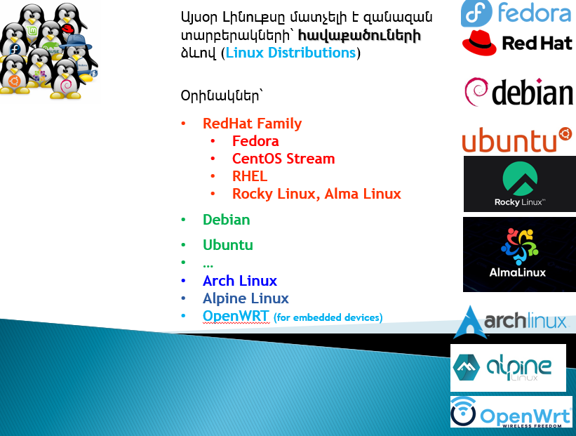
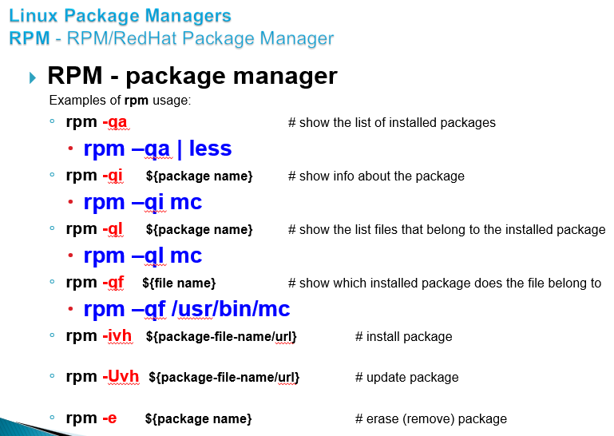
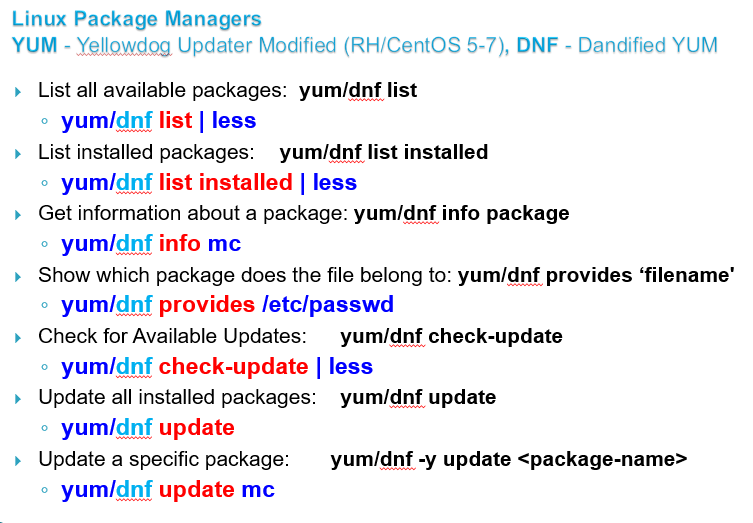
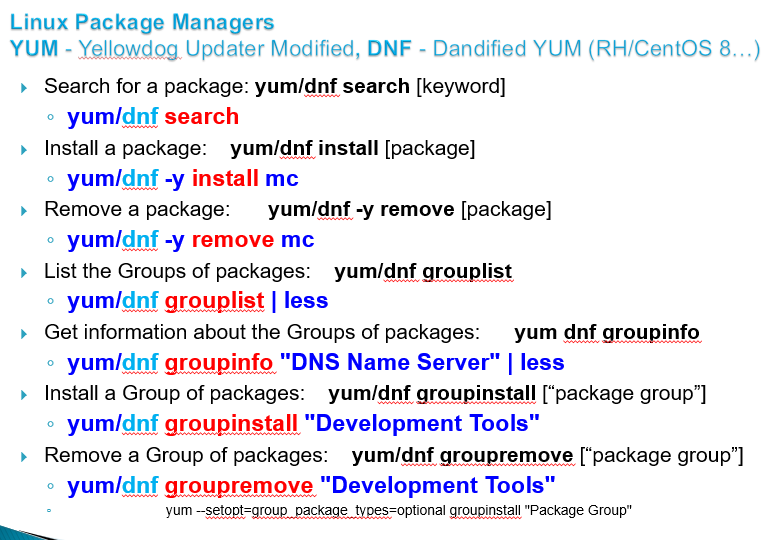

# Linux Essentials (level 1)   Լինուքսի Հիմունքներ (փուլ 1)

## Managing Software packages

Almost all modern Linux distributions have a system for **Software Package Management** to
* find
* install
* configure
* upgrade
* remove

Source of that packages is called **Repository**.

  

  

  

For AlmaLinux / Rocky / Fedora / RHEL: `.rpm` packages installed by `yum` `dnf` `rpm`
For Debian / Ubuntu: `.deb` packages installed by `apt` and `dpkg`

### RedHat Family Linux Package Managers 
* RPM - RPM/RedHat Package Manager (basic tool)
* YUM - Yellowdog Updater Modified (RH/CentOS 5-7) 
* DNF - Dandified YUM  (RH/CentOS/Almalinux/Rocky 8,9…) 

  

  

  

