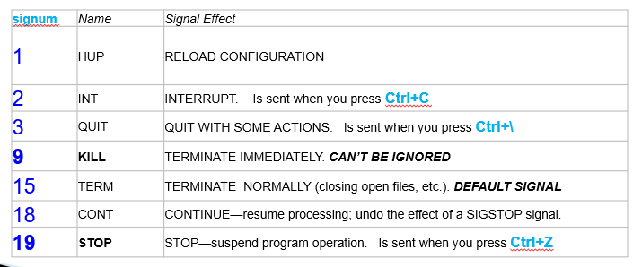
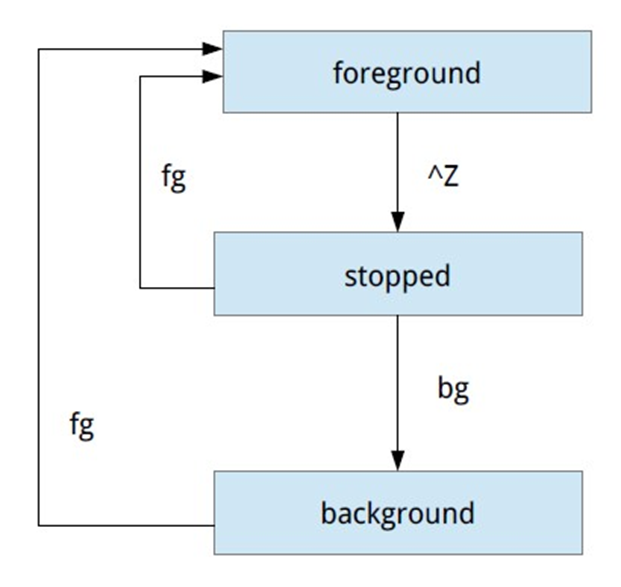

# Linux Essentials (level 1) Linux-ի Հիմունքներ (փուլ 1)


## Detect Linux Distribution

There are several ways to understand which distribution are you on.

```bash
cat /etc/issue
```

```bash
cat /etc/os-release
```

```bash
cat /etc/system-release
```


(RedHat/CentOS/Almalinux/Rocky versions **in addition** will have (in form of one symlink of other):
* `/etc/redhat-release`
* `/etc/centos-release`
* `/etc/rocky-release`
* `/etc/almalinux-release`

```bash
ls -la /etc/os-release
```

```bash
ls -la /etc/system-release
```

```bash
ls -la /etc/redhat-release
```


## Disk/file space usage (du)

* **du** - "_disk usage_" - Ցույց տալ դիրեկտորիայի չափը


`du -h`	- չափերը լինեն մարդու համար ընթեռնելի k-Kb, M-Mb, G-Gb 

`du -d1` - միայն 1 մակարդակ ներս (հին տարբերակներում `--max-depth`)

`du -s` - Ցույց տալ ընդհանուր չափը (նույնն է ինչ `-d 0` )


Ցույց տալ /var/log-ի ընդհանուր չափը, սխալների հաղորդագրությունները ուղարկել /dev/null
```bash
du -hs /var/log 2>/dev/null
```

Ցույց տալ /var-ի յուրաքանչյուր դիրեկտորիայի  չափը
```bash
du -hd1 /var
```

Այլ տարբերակ
```bash
du -sh /var/*
```

#### PRACTICE

Գրել հրամանների հաջորդականություն, որը ցույց կտա /etc-ի յուրաքանչյուր դիրեկտորիայի չափը
* արդյունքը դասավորել ըստ չափերի՝ փոքրից մեծ /թվային/
* չափերը լինեն մարդու համար ընթեռնելի՝ Mb,Gb-ով
* սխալների հաղորդագրությունները ուղարկել /dev/null


### NSDU (NCurses Disk Usage) - better solution

`ncdu` - is better solution to understand current disk space usage.

Install it.

```bash
sudo dnf -y install ncdu
```

How it works:
You should specify initial directory (if not specified it uses current one).
Program starts counting disk space inside that directory.

> NOTE! In each session you will be able to work only inside that dir. 
> To go upper you need to quit and run program again with other directory path.


Example:

```bash
ncdu /var/log
```


Press `?` to see Help screen.

Here are interesting keys:
* `d` to delete file or directory (be careful !!!).
* `g` press multiple times to see usage percentage in different ways.
* `t` show directories on the top (before files)
* `s` sort by size 
* `n` sort by name
* `r` recalculate disk space
* `b` run sub-shell in current directory


## Disk/file space usage (df)

* **df** - "disk free" - ցույց տալ միացված partition-ները ֆայլային համակարգերը 
և զբաղեցրած/ազատ չափը


`df -h`  չափերը լինեն մարդու համար ընթեռնելի k-Kb, M-Mb, G-Gb 

`df -T`  ցույց տալ ֆայլային համակարգի տեսակը

`df -hT -x tmpfs -x devtmpfs` ցույց չտալ `tmpfs` և `devtmpfs` ֆայլային համակարգերը

## File Search - Ֆայլերի որոնում

**find** - որոնում Ֆայլերի տարբեր հատկանիշներով


```bash
find /etc -name "passwd*" 2> /dev/null
```

```bash
find ~ -name "f*“
```

```bash
find ~ -type l 2> /dev/null
```
> _-type_  կարող է լինել <br>
>   **d**    directory <br>
>   **f**    regular file <br>
>   **l**    symbolic link <br>

```bash
find ~ -name "f*" -type l 2> /dev/null
```

```bash
find /bin -size +20000k
```

```bash
find /usr/sbin -size 2M -name "t*" -exec ls -l {} \;
```

```bash
find /usr/sbin -size +100k -name "t*" -ok cp {} /tmp \;
```


## Processes

**Պրոցես** = **աշխատող ծրագիր**


* Պրոցեսի պարամետրեր՝
* Եզակի համար 	Process ID (**PID**)
* Ծնողի համար  	Parent Process ID (**PPID**)
* Վիճակ 		State
* Տերմինալ 		**TTY** (`daemon` պրոցեսները չունեն TTY)
* Իրական օգտագործողի համար  Real user ID (**RUID**)
* Գործող օգտագործողի համար Effective user ID (**EUID**)
* Իրական խմբի համար Real group ID (**RGID**)
* Գործող խմբի համար Effective group ID (**EGID**)

### Պրոցեսների վիճակներ

* Running / Runnable (**R**)
* Sleeping 
  * Interruptable (**S**)
  * Uninterruptible (**D**)
* Stopped (**T**)
* Defunct / Zombie (**Z**)


Գործիքներ`

* ps
* pstree
* top
* htop
* gnome-system-monitor


Օրինակներ`

```bash
ps
```
```bash
ps l
```

```bash
ps -o pid,ppid,user,cmd
```

```bash
ps aux 
```

```bash
ps -eo pid,ppid,user,cmd 
```

```bash
pstree 
```

```bash
pstree -u –p
```

```bash
top
```

#### PRACTICE

Բացեք 3 տերմինալ, երկու պատուհանում տվեք `cat` հրամանը,
3-րդ տերմինալում տվեք հետևյալ հրամանը
`ps aux | grep cat`


Պրոցեսի կառավարում՝


* kill 
* kill -l 
* kill [-signnum] <PID> 
* pkill <process_name>
* pgrep -l bash
* pidof <process_name>
* killall [-signum] <process_name> 



### Background processes 




Հրամաններից հետո `&` նշան դնելիս ուղարկում ենք ետին պլան (background) 

`command &`

Գործիքներ`

 `jobs`     - List  the  active  jobs
 `kill %n` - Kill the foreground  job 
 `fg [#n]` - Resume job in the foreground, 
                 and make it the current  job. 

#### PRACTICE

* Տվեք `man ls` հրամանը, սեղմեք `Ctrl-Z`
* Տվեք `top` հրամանը, սեղմեք `Ctrl-Z`
* Տվեք `jobs` հրամանը

> [1]-  Stopped                 man ls <br> 
> [2]+  Stopped                 top

* Տվեք `fg 1` հրամանը

Հարց՝ ինչպե՞ս լրիվ անջատել այդ ցրագրերը:

### Login / Logout

Global Login Config Files:
* `/etc/profile`
* `/etc/bash.bashrc`

Per-User Login Config Files:
* `~/.bash_profile` 
  * հաճախ ընդգրկում է `~/.bashrc`
* `~/.bash_login`   
* `~/.profile`
Կատարվելու է այս 3-ից մեկը

Մեջբերում `man bash`-ի `INVOCATION` հատվածից

> When bash is invoked as an **interactive login shell** ...
> it first reads and executes commands from the file `/etc/profile`, if that file exists.  
> After reading that file, it looks for
>    `~/.bash_profile`,  `~/.bash_login`,  and `~/.profile`, **in that order**, 
> and reads and executes commands from the FIRST ONE that exists and is readable.  


#### PRACTICE
* `clear` հրամանը մաքրում է էկրանը
  * ստեղծել `c` անունով `alias`, որ մաքրում է էկրանը
  * պահպանել այն, որ գործի մյուս մուտքագրվելիս նույնպես


Logout

*   `~/.bash_logout`

