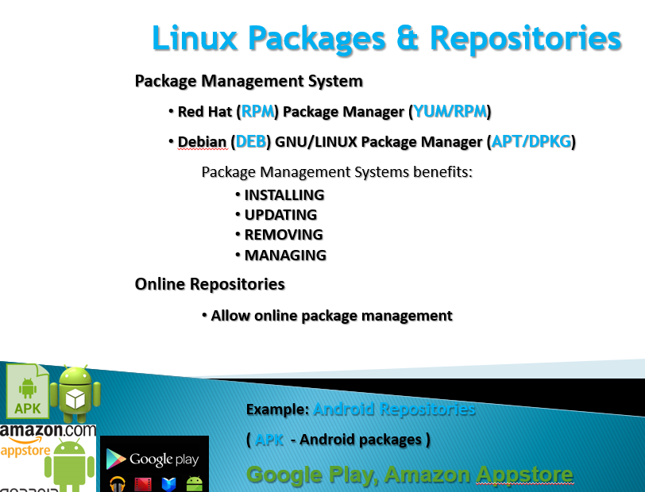

# Linux Administration and Networking Basics (level 2) Linux-ի կառավարում և ցանցային հիմունքներ (փուլ 2)

## Managing Software packages

Almost all modern Linux distributions have a system for **Software Package Management** to
* find
* install
* configure
* upgrade
* remove

Source of that packages is called **Repository**.

  

  

  

For Rocky / Fedora / RHEL: `.rpm` packages installed by `yum` `dnf` `rpm`
For Debian / Ubuntu: `.deb` packages installed by `apt` and `dpkg`

### RedHat Family Linux Package Managers 
* RPM - RPM/RedHat Package Manager 
* YUM - Yellowdog Updater Modified (RH/CentOS 5-7) 
* DNF - Dandified YUM  (RH/CentOS 8…) 

  

  

  

